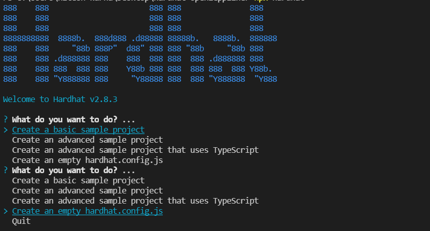

# Using Hardhat

[Hardhat](https://hardhat.org/) is a development environment that allows developers to test, compile, deploy, and debug dApps based on EVM. It helps developers in managing many of the responsibilities associated with constructing dApps and smart contracts. Because hardhat can interface directly with ICE's ethereum api, it can be used to deploy smart contract on ICE network.

Here we are going to deploy an ERC-20 contract using openzeppelin.

### Create Project

Create a directory to store all the files

```
mkdir hardhat-tutorial && cd hardhat-tutorial
```

### Initialize npm package and install dependencies

Initialize npm package and install following dependencies.

```
npm init -y
npm install --save-dev hardhat
npm install ethers @nomiclabs/hardhat-waffle @nomiclabs/hardhat-ethers
npm install @openzeppelin/contracts
```

### Run Hardhat

In the same directory **run:**

```
npx hardhat
```

select `Create an empty hardhat.config.js` with your keyboard and hit enter



### Create Smart Contract

Lets create our ERC-20 smart contract

* Create a directory `contracts` in root where we will store our contracts
* Create a file in `contracts/MyToken.sol` which ERC20 token smart contract.

```
// SPDX-License-Identifier: MIT
pragma solidity ^0.8.2;

import "@openzeppelin/contracts/token/ERC20/ERC20.sol";
import "@openzeppelin/contracts/access/Ownable.sol";

contract MyToken is ERC20, Ownable {
    constructor() ERC20("MyToken", "MTK") {
        _mint(msg.sender, 1000 * 10 ** decimals());
    }

    function mint(address to, uint256 amount) public onlyOwner {
        _mint(to, amount);
    }
}
```


**NOTE**: The above contract can be generated from [contracts wizard](https://wizard.openzeppelin.com/#erc20) with a mint value of 1000 tokens and feature set to mintable.


### Modify Config file

Modifying hardhat configuration file, add Arctic testnet entries to _<mark style="color:blue;">hardhat.config.js</mark>_ file in the url parameter.

```
require("@nomiclabs/hardhat-waffle");
const ICE_PRIVATE_KEY = "your private key";
module.exports = {
  solidity: "0.8.2",
  networks: {
    testnet: {
      url: `https://arctic-rpc.icenetwork.io:9933`,
      accounts: [`0x${ICE_PRIVATE_KEY}`]
    }
  }
};
```

### Compile

Compile the contract

```
npx hardhat compile                                                                                                                             
```

### Deploy

Lets create a new directory `scripts` inside project's root directory and paste following code in `scripts/deploy.js`

```
async function main() {
    const [deployer] = await ethers.getSigners();
  
    console.log("Deploying contracts with the account:", deployer.address);
  
    console.log("Account balance:", (await deployer.getBalance()).toString());
  
    const Token = await ethers.getContractFactory("MyToken");
    const token = await Token.deploy();
  
    console.log("Token address:", token.address);
  }
  
  main()
    .then(() => process.exit(0))
    .catch((error) => {
      console.error(error);
      process.exit(1);
    });
```

Finally run:

```
npx hardhat run scripts/deploy.js --network testnet
```


After deployment is successful, we will get the contract address where our token is deployed

