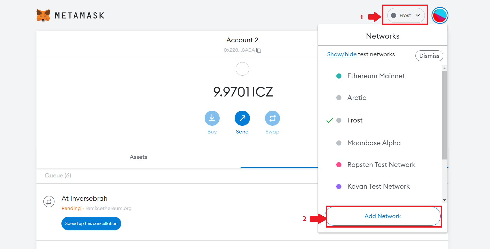

# Configuring Metamask

You can connect to the EVM on [SNOW Mainnet](../network-endpoints.md#snow-network) and [Arctic Testnet](../network-endpoints.md#arctic-testnet) using Metamask.

## Steps

Open Your Metamask, then:

1. Click on the network dropdown
2. Click on Add Network

You will be redirected to **Networks -> Add a network** page.

### SNOW Network Configuration

Add the following network configuration details:

* Network Name: `SNOW Network`
* RPC URL: `https://snow-rpc.icenetwork.io:9933`
* ChainID: `552` (hex: `0x228`)
* Symbol (Optional):`ICZ`

<figure><figcaption></figcaption></figure>

Click on **Save** and you are ready to interact with SNOW Mainnet using metamask

### Arctic Testnet Configuration

Add the following network configuration details:

* Network Name: `Arctic`
* RPC URL: `https://arctic-rpc.icenetwork.io:9933`
* Chain ID: `553` (hex: `0x229`)
* Symbol (Optional):`ICZ`
* Block explorer URL (Optional): `https://arctic.epirus.io`

<figure><figcaption></figcaption></figure>

Click on **Save** and you are ready to interact with Arctic testnet using metamask
