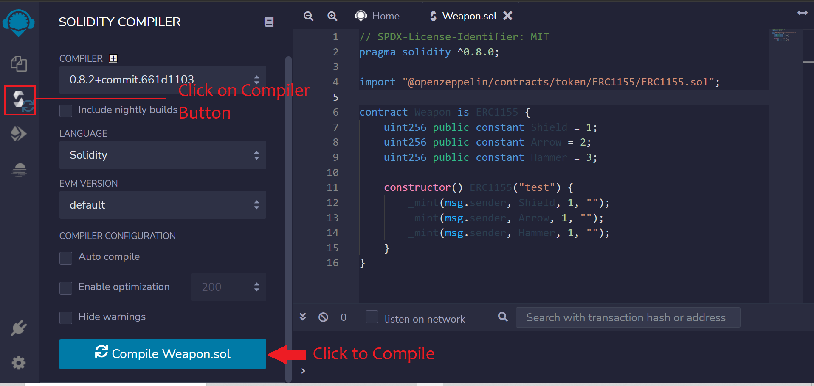

# NFTs(ERC721 & ERC1155)

NFTs are a new type of digital asset. They are non-fungible tokens which means that each token is unique, meaning that no two tokens are alike. The NFTs can represent ownership of in-game items, physical assets, or even just data. This unique sort of Token has incredible potential, and it demands a suitable standard; the ERC721 & ERC1155 was created to address this issue.

### A simple ERC721 token

The ERC-721 sets a standard for NFT, which means that this type of Token is distinct and may have a different value than another Token from the same Smart Contract, which may be related to its age or rarity.

The ERC721 smart contract below is created using contract wizard:

```
// SPDX-License-Identifier: MIT
pragma solidity ^0.8.4;

import "@openzeppelin/contracts/token/ERC721/ERC721.sol";
import "@openzeppelin/contracts/access/Ownable.sol";

contract MyToken is ERC721, Ownable {
    constructor() ERC721("MyToken", "MTK") {}

    function _baseURI() internal pure override returns (string memory) {
        return "test";
    }

    function safeMint(address to, uint256 tokenId) public onlyOwner {
        _safeMint(to, tokenId);
    }
}
```

It is a simple ERC721 mintable token, which provides a `mint` function that can only be called by the owner of the contract. By default, the owner is the contract's deployer address.

You can go on and deploy this contract on arctic testnet using Remix IDE by following this [link](../using-remix/).

### GameCard NFT

Now let's use ERC721 standard to create a collectible called 'GameCard'. Each GameCard will be owned by someone. Here, we will provide a 'GameCard' to a player. i.e. Each card will be minted and sent to a player's address. Players have the option of keeping their token or transferring it to other players.

Here's what the contract looks like:

```
// SPDX-License-Identifier: MIT
pragma solidity ^0.8.0;

import "@openzeppelin/contracts/token/ERC721/ERC721.sol";
import "@openzeppelin/contracts/utils/Counters.sol";

contract GameCard is ERC721 {
    using Counters for Counters.Counter;
    Counters.Counter private _tokenIds;

    constructor() ERC721("GameItem", "GIT") {}

    function createItem(address player) public returns (uint256) {
        _tokenIds.increment();

        uint256 newItemId = _tokenIds.current();
        _safeMint(player, newItemId);

        return newItemId;
    }
}
```

The GameCard token is initialized with a token name **GameItem** and a symbol **GIT** through the constructor.

**Counter** is also imported from openzeppelin which is a simple way to get a counter that can only be incremented or decremented.

**CreateItem** function simply mints the token to the given address and returns the tokenId when the item is minted.



&#x20;_Currently, any account can call `createItem` to mint items. To restrict what accounts can mint items we can add_ [_Access Control_](https://docs.openzeppelin.com/contracts/4.x/access-control)_._


Now you can go on and deploy the above contract in arctic testnet using Remix IDE in injected web3 environment as demonstrated [here](../using-remix/).

### ERC1155 token standard

ERC1155 is a multi-token standard that enables the production of fungible, non-fungible, and semi-fungible tokens in a single contract. Before ERC1155, if a use case required both ERC20 (fungible) and ERC721 (non-fungible) tokens, two contracts were necessary. ERC1155 also enables the launch of several NFT collections in a single smart contract rather than developing a separate contract for each collection.

ERC1155 is commonly used in blockchain-based decentralized games, which require currencies and collectibles, hence it has become a standard there.

Here, we will create 3 NFT collections (Shield, Arrow, and Hammer) with a single NFT in each one.

The smart contract code looks like:

```
// SPDX-License-Identifier: MIT
pragma solidity ^0.8.0;

import "@openzeppelin/contracts/token/ERC1155/ERC1155.sol";

contract Weapon is ERC1155 {
    uint256 public constant Shield = 1;
    uint256 public constant Arrow = 2;
    uint256 public constant Hammer = 3;

    constructor() ERC1155("test") {
        _mint(msg.sender, Shield, 1, "");
        _mint(msg.sender, Arrow, 1, "");
        _mint(msg.sender, Hammer, 1, "");
    }
}
```

In the above smart contract, first ERC1115 is imported from openzeppelin.

Then we have created a contract named **Weapon** and also created three variables Shield, Arrow, and Hammer assigning each with a unique id.

Then we have initialized the constructor by passing tokenUri (_in our case 'test'_) which mints the different NFTs by calling function `_mint` passing the following params in it:

* **msg.sender** is the address on which token will be minted. It is also the address of the contract deployer.
* The second parameter is token id,  which we have already assigned to variables like Shield, Arrow, and Hammer
* Third parameter is the amount of each token we want to mint, which is 1 in this case.
* The last parameter is the data field which is kept empty here.

Now let us head over to [**Remix IDE**](https://remix.ethereum.org/) to compile and deploy our NFT.

In a workspace, create a file named **`Weapon.sol`**


Now navigate to Compile tab on from left navigation and click on **Compile Weapon.sol** button



**To deploy the contract:**

1. Navigate to **Deploy and Run Transaction** tab
2. Select the environment as **Injected Web3** (Make sure, your metamask is configured to [Arctic testnet](../../configuring-metamask.md#arctic-testnet-configuration))
3. Select **Weapon.sol** contract
4. Click on **Deploy**
5. Now it will pop up metamask to confirm the transaction, **Confirm** it.


Now that the contract is deployed you can interact with it methods.
