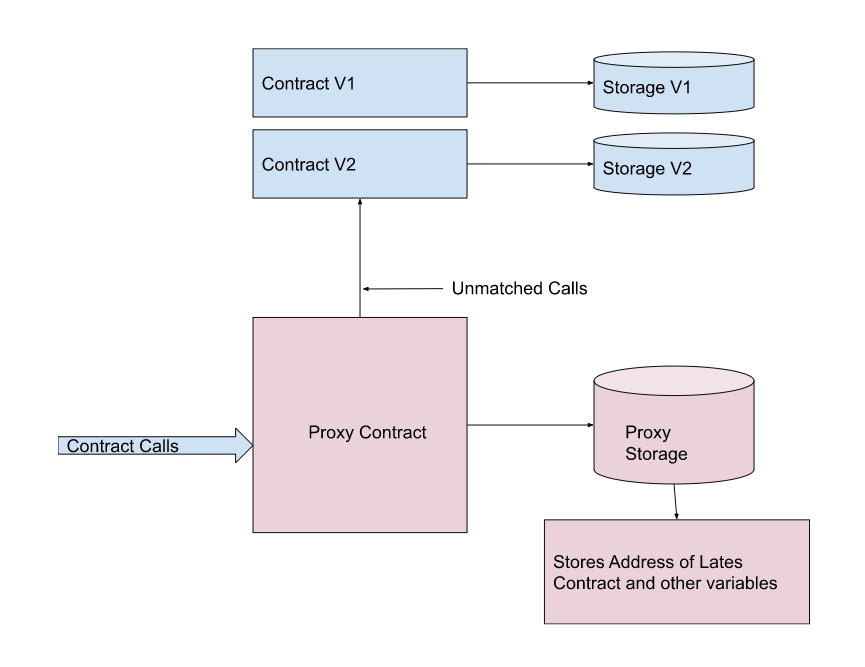

# Run a node locally

Find all the live testnets [here](../ice-testnet-details/network-endpoints/).

Alternatively, you can run a test node locally on your machine.

You can clone the github repository [https://github.com/web3labs/ice-substrate](https://github.com/web3labs/ice-substrate) and follow the guidelines written in _<mark style="color:blue;">`README.md`</mark>_ to run a node on your local machine.

Once your node is running you should be able to see output similar to this on your terminal:&#x20;

### Connecting to Polkadot.js

Now you can use [polkadot explorer ](https://polkadot.js.org/apps/#/explorer)to communicate to the node. The two provided endpoints are:&#x20;

* **WS** - `ws://127.0.0.1:9944`
* **HTTP** - `http://127.0.0.1:9933`


**NOTE: **_**** More about using polkadot explorer is_ [_here_](../polkadot.js-app/using-polkadot.js-app.md)__


### Configuring Metamask

Once the node is started and running , you can configure your metamask to the test node to start deploying smart contracts and building dapps on test node.

Configure network in your metamask according to following settings:

* Network Name: `Ice test node`
* RPC URL: `http://127.0.0.1:9933`
* ChainID: `553`
* Symbol (Optional):`ICZ`

``
