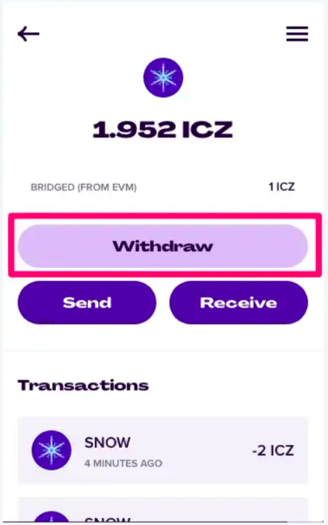

# Running ICE blockchain locally

Find all the live testnets [here](../ice-testnet-details/network-endpoints/).

**Developers looking to build smart contracts on ICE blockchain can run ICE blockchain locally, inspect the blockchain state, and test their code.**

* Install Rust

```
curl --proto '=https' --tlsv1.2 -sSf https://sh.rustup.rs | sh
```

* Configure your Rust environment

```
rustup default stable
rustup update
rustup update nightly
rustup target add wasm32-unknown-unknown --toolchain nightly
```


**Depending on the OS, Wasm toolchain might require manual installation.**

E.g. on macOS (Big Sur v11.6), Wasm is added using following command

`rustup target add wasm32-unknown-unknown --toolchain nightly-x86_64-apple-darwin`


* Clone local frontier node

```
git clone https://github.com/web3labs/ice-substrate
```

* Build the development node

```
cargo build --release
```

* Run the local dev node

```
./target/release/ice-node --dev
```

Once your node is running you should be able to see output similar to this on your terminal:&#x20;



### Connecting to Polkadot.js

Now you can use [polkadot explorer ](https://polkadot.js.org/apps/#/explorer)to communicate to the node. The two provided endpoints are:&#x20;

* **WS** - `ws://127.0.0.1:9944`
* **HTTP** - `http://127.0.0.1:9933`


**NOTE: **_**** More about using polkadot explorer is_ [_here_](../polkadot.js-app/using-polkadot.js-app.md)__


### Configuring Metamask

Once the node is started and running , you can configure your metamask to the test node to start deploying smart contracts and building dapps on test node.

Configure network in your metamask according to following settings:

* Network Name: `Ice test node`
* RPC URL: `http://127.0.0.1:9933`
* ChainID: `553`
* Symbol (Optional):`ICZ`

``
