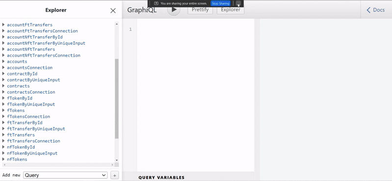

# Subsquid for data indexing

[**Subsquid**](https://docs.subsquid.io/) is a framework for indexing or querying data on Substrate-based blockchains. Moreover, Subsquid is an [**ETL**](https://en.wikipedia.org/wiki/Extract,\_transform,\_load) (Extract, Transform, Load) project that collects on-chain data and provides a GraphQL API to query those data.

We have already published some medium articles which explains about **Subsquid** whose links are provided below:

### 1. Indexing ERC-721 token transactions in the Arctic network.



### 2. Indexing ERC-20 token transactions in Arctic network.



We have also deployed a **squid** at [http://18.176.158.245:4350/graphql](http://18.176.158.245:4350/graphql),where we have indexed **ERC721**,**ERC20** and **ERC1155** token transfers event of the Arctic testnet network.

You can head over to [http://18.176.158.245:4350/graphql](http://18.176.158.245:4350/graphql),which will open a GraphQL playground for playing with queries.


**NOTE: **_**Currenlty the endpoint** http://18.176.158.245:4350/graphql **is down.**_


**For example**: let us query 10 fungible tokens (ERC20) by their name, symbol, and address.

```
query MyQuery {
  fTokens(limit: 10) {
    id
    name
    symbol
  }
}
```

<figure><figcaption><p>GraphQl playground</p></figcaption></figure>

You can play with queries here after all it’s a _**playground**_.

[Subsquid’s documentation](https://docs.subsquid.io/) is full of useful information, and it’s the best place to start if you have questions about anything that wasn’t covered in this introductory section.
