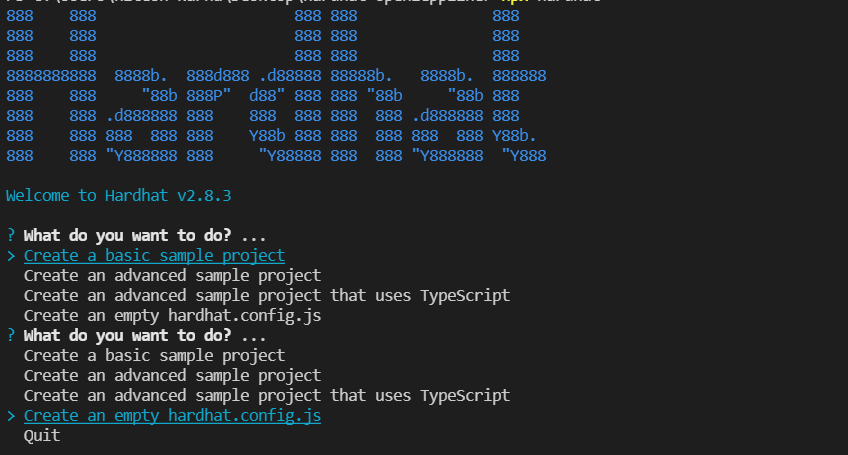

# Using Hardhat

Here we are going to deploy an ERC-20 contract using openzeppelin.

* Create a directory to store all the files

```
mkdir hardhat-tutorial && cd hardhat-tutorial
```

* Initialize npm package and install following dependencies.

```
npm init -y
npm install --save-dev hardhat
npm install ethers @nomiclabs/hardhat-waffle @nomiclabs/hardhat-ethers
npm install @openzeppelin/contracts
```

* In the same directory **run:**

```
npx hardhat
```

select `Create an empty hardhat.config.js` with your keyboard and hit enter



* Lets create our ERC-20 smart contract
  * Create a directory `contracts` in root where we will store our contracts
  * Create a file in `contracts/MyToken.sol` which ERC20 token smart contract.

```
// SPDX-License-Identifier: MIT
pragma solidity ^0.8.2;

import "@openzeppelin/contracts/token/ERC20/ERC20.sol";
import "@openzeppelin/contracts/access/Ownable.sol";

contract MyToken is ERC20, Ownable {
    constructor() ERC20("MyToken", "MTK") {
        _mint(msg.sender, 1000 * 10 ** decimals());
    }

    function mint(address to, uint256 amount) public onlyOwner {
        _mint(to, amount);
    }
}
```


**NOTE**: The above contract can be generated from [contracts wizard](https://wizard.openzeppelin.com/#erc20) with a mint value of 1000 tokens and feature set to mintable.


* Modifying hardhat configuration file, add ICE testnet entries to _<mark style="color:blue;">hardhat.config.js</mark>_ file in the url parameter.

```
require("@nomiclabs/hardhat-waffle");
const ICE_PRIVATE_KEY = "your private key";
module.exports = {
  solidity: "0.8.2",
  networks: {
    testnet: {
      url: `http://51.158.117.160:9933`,
      accounts: [`0x${ICE_PRIVATE_KEY}`]
    }
  }
};
```

* Compile the contract

```
npx hardhat compile
```

* Deploy                                                                                                                                                Lets create a new directory `scripts` inside project's root directory and paste following code in `scripts/deploy.js`

```
async function main() {
    const [deployer] = await ethers.getSigners();
  
    console.log("Deploying contracts with the account:", deployer.address);
  
    console.log("Account balance:", (await deployer.getBalance()).toString());
  
    const Token = await ethers.getContractFactory("MyToken");
    const token = await Token.deploy();
  
    console.log("Token address:", token.address);
  }
  
  main()
    .then(() => process.exit(0))
    .catch((error) => {
      console.error(error);
      process.exit(1);
    });
```

Finally run:

```
npx hardhat run scripts/deploy.js --network testnet
```


After deployment is successful, we will get the contract address where our token is deployed

