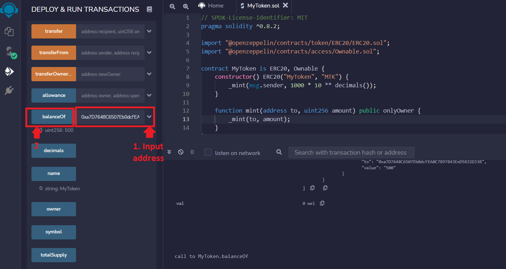

# Interact with smart contract using Remix

After the contract is deployed , you can find all the read and write functions of the contract under  **Deployed Contracts**.

Lets interact with few methods from the contract:

* Transfer some token to an address                                                                                                Since we preminted 1000 token, we can transfer upto 1000 token without minting another ( You can always mint more tokens by calling mint function).
  1. Click on the expandable arrow right to transfer
  2. Lets send 500 tokens to address: 0xa7D7648C6507Eb0dcFEA0C7897843EeD5832D338
  3. It will ask for metamask confirmation, allow it from metamask

If everything goes successful, you will be able to see similar output in remix **console**

*   Call **balance** method to check available balance in an address

    1. Input the address you want to check balance, to next input field to **balance** function         For example: lets check balance of address we recently send tokens to
    2. Click on **balance** , it will show 500 as output.

