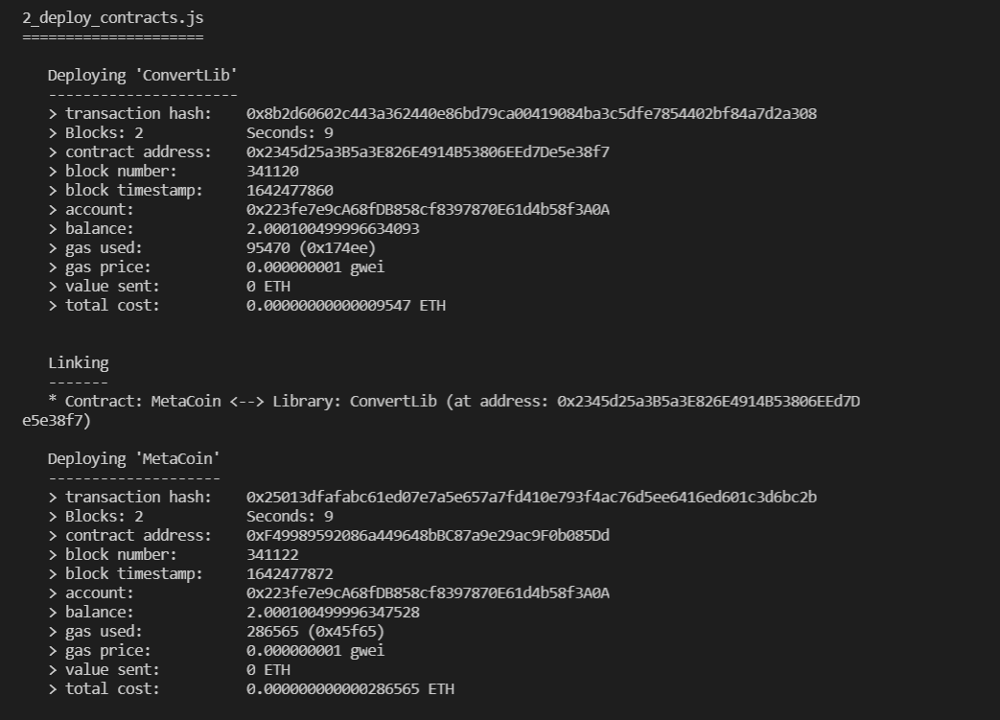

# Using Truffle

* Install truffle globally

```
npm install -g truffle
```

* Create a metacoin project using following commands one by one

```
mkdir metacoin && cd metacoin
truffle unbox metacoin 
npm install --save-dev @truffle/hdwallet-provider
```

After you've done this process, you'll have a project structure that includes the following items:&#x20;

&#x20;_contracts/_: Directory for Solidity contracts&#x20;

_migrations/_: Directory for scriptable deployment files&#x20;

_test/_: Directory for test files&#x20;

_truffle-config.js_: Truffle config file&#x20;

* Modify truffle-config.js to add Ice test network.Also make sure to add your private key.

```
const HDWalletProvider = require('@truffle/hdwallet-provider');
const privateKeyTest = 'Your Private Key';

module.exports = {
  networks: {
    testnet: {
      provider: () => {
        if (!privateKeyTest.trim()) {
          throw new Error(
            'Please provide a private key with funds'    
          );
        }
        return new HDWalletProvider({
          privateKeys: [privateKeyTest],
          providerOrUrl: 'http://51.158.117.160:9933',
        });
      },
      network_id: 42,
      timeoutBlocks: 100 // To avoid quick timeouts
    },
  },
};
```

* Compile and deploy

```
truffle compile
truffle deploy --network testnet
```

If everything goes right, you will be able to see output like this:&#x20;



**NOTE**: If you get timeout errors then try adding following parameters to config file just below the network id & deploy with deploy command 2-3 times.

```
networkCheckTimeout: 9000000,
timeoutBlocks: 10000,
skipDryRun: true,
```
