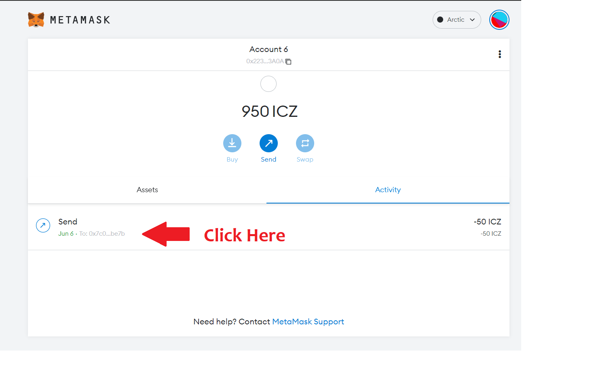
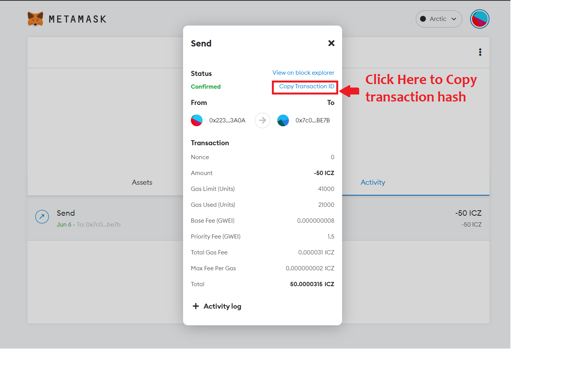
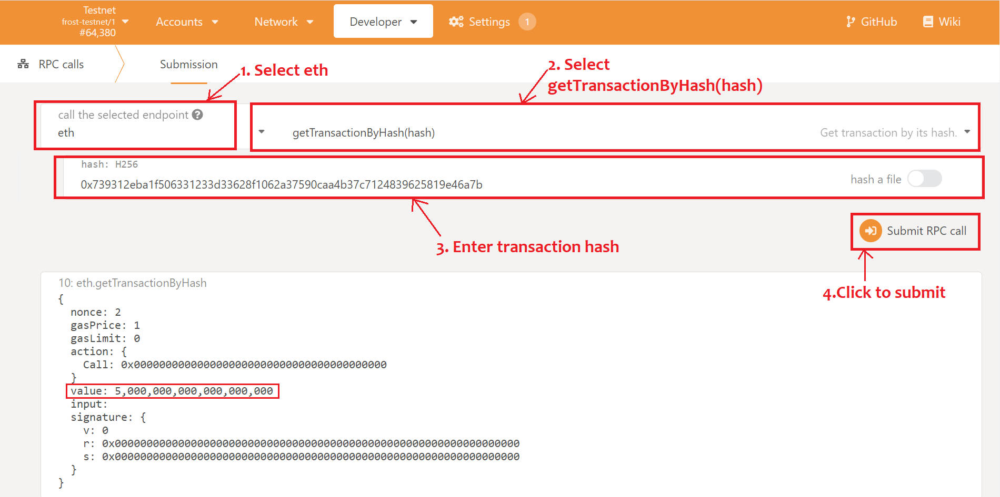

# View EVM transactions

Here we will demonstrate how you can view details of an ICZ transfer transaction made using Metamask.

For this you will need a Metamask account having some testnet tokens (ICZ) and configured with Arctic testnet network.

* For funding your account with ICZ: [Faucet](../../build/faucet/)
* For configuring your Metamask to SNOW Mainnet: [SNOW Mainnet](../../build/network-endpoints.md#snow-network)
* For configuring your Metamask to Arctic testnet: [Arctic Testnet](../../build/network-endpoints.md#arctic-testnet)

### Making a transaction using Metamask

#### Making ICZ Transfer

* Open Metamask and click on **Send** button to transfer some ICZ to another account.
* Enter the **address** and the **amount** you want to send and click **Next**


We have transferred **50 ICZ** from **0x223fe7e9ca68fdb858cf8397870e61d4b58f3a0a** to  **0x7c0f5f59a22b657c8d9e21b44d2dc0118fd2be7b**


 (2) (1).png>)

#### Getting Transaction hash

* Open Metamask and under **Activity** tab you will find recent transaction named **Send**, click here.

* Next a popup will appear, click on **Copy Transaction ID** to get transaction hash.

### Getting transaction details in polkadot.js explorer

* Select RPC calls from the Developer dropdown option on the navigation bar.

 (1).png>)

#### Transaction Details

1. Select **eth** endpoint from left dropdown option.
2. Select **getTransactionReceipt(hash)** method **** from right dropdown option.
3. Enter the **transaction hash** copied from metamask **** in the **hash** input field.
4. Click **Submit RPC call** button **** to view transaction details.

Next you will be able to see the transaction details as shown in the figure:

 (1).png>)

Here we can see we have transferred ICZ                                                                                              **from**: 0x7c0f5f59a22b657c8d9e21b44d2dc0118fd2be7b                                                                     **to**: 0x223fe7e9ca68fdb858cf8397870e61d4b58f3a0a

Next we can call **eth** -> **getTransactionByHash(hash)** method  to view amount of ICZ transferred.

1. Select **eth** endpoint from left dropdown option.
2. Select **getTransactionByHash(hash)** method **** from right dropdown option.
3. Enter the **transaction hash** in the **hash** input field.
4. Click **Submit RPC call** button **** to view transaction details.

Here we can see amount of ICZ transferred in the **value** field whose unit is in wei (10^18).

You can convert it to decimals by dividing by 10^18. i.e

**value** : **5000000000000000000/10^18** = **5 ICZ**

Hence we transferred 5 ICZ using metamask from one account to another and view transaction details in polkadot.js explorer.
