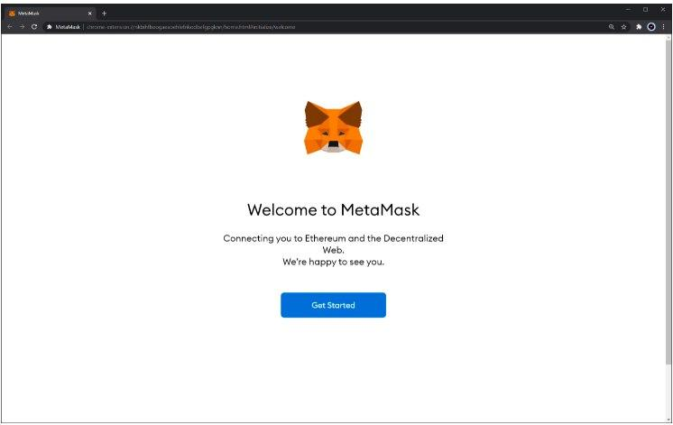
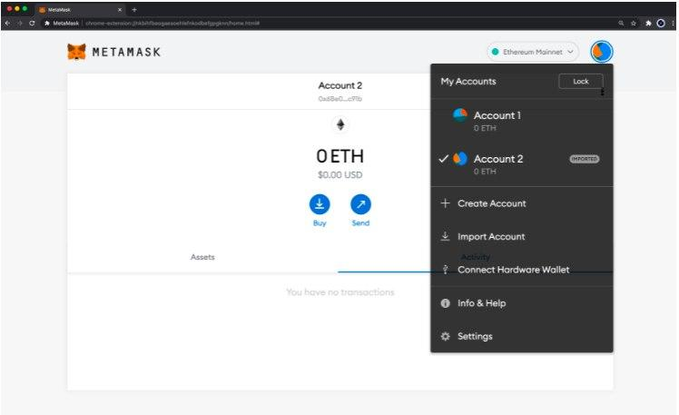

# Interacting with Frost Using Metamask

### Install the Metamask Extension

First, we start with a fresh and default [MetaMask](https://metamask.io) installation from the Chrome store. After downloading, installing, and initializing the extension, follow the **Get Started** guide. In there, you need to create a wallet, set a password, and store your secret backup phrase (this gives direct access to your funds, so make sure to store these in a secure place).

### Create a Wallet

After installing [MetaMask](https://metamask.io), the setup will automatically open a new task with a welcome screen. Click **Get Started** to begin the setup process.

### Connect MetaMask to Frost 

When prompted, you are given the option to import a wallet using a recovery seed phrase. For this exercise, set up a new wallet.

.jpg>)

Once you have [MetaMask](https://metamask.io) installed and have created or imported an account, you can connect it to Frost by clicking on the network dropdown and selecting **Add Network**.

* Network Name: `Frost`
* RPC URL: `http://frost-rpc.icenetwork.io:9933`
* ChainID: `553` (hex: `0x229`)
* Symbol (Optional):`ICZ`

.jpg>)

