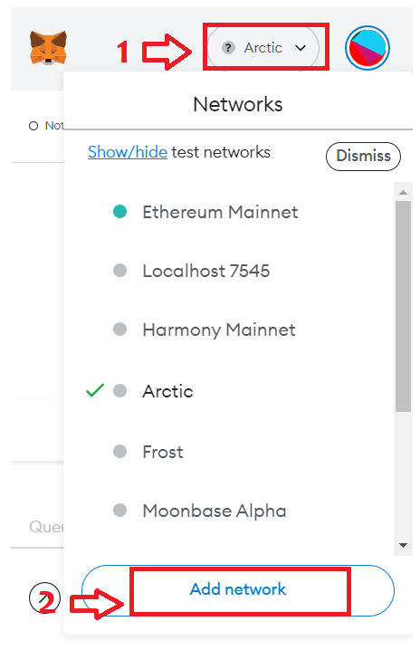

# Interacting with Snow Using Metamask

## Configure Metamask for Snow

Open Your Metamask wallet and :-

1. Click on the network dropdown
2. Click on Add Network

You will be redirected to **Networks -> Add a network** page.

### Adding Configuration

Add the following network configuration details:

* Network Name: `Snow Network`
* RPC URL: `https://snow-rpc.icenetwork.io:9933`
* ChainID: `551` (hex: `0x227`)
* Symbol (Optional):`ICZ`

<figure><figcaption></figcaption></figure>

Click on **Save** and you are ready to interact with Snow mainnet using metamask
